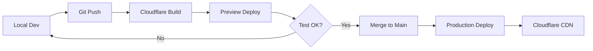

# 🌐 Deploy Tunetalks lên Cloudflare Pages

Hướng dẫn chi tiết để deploy Tunetalks (Element Web custom build) lên Cloudflare Pages.

---

## 📋 Mục Lục

- [Tổng Quan](#tổng-quan)
- [Prerequisites](#prerequisites)
- [Cloudflare Pages Setup](#cloudflare-pages-setup)
- [Build Configuration](#build-configuration)
- [Deployment Methods](#deployment-methods)
- [Environment Variables](#environment-variables)
- [Custom Domain](#custom-domain)
- [Troubleshooting](#troubleshooting)

---

## 🎯 Tổng Quan

Cloudflare Pages là platform hosting tĩnh (static site) hoàn hảo cho Element Web vì:

✅ **Free tier** với unlimited bandwidth  
✅ **Global CDN** - tốc độ tải nhanh trên toàn cầu  
✅ **Auto SSL** - HTTPS tự động  
✅ **Git integration** - auto deploy khi push code  
✅ **Preview deployments** - test trước khi production  
✅ **Rollback** - quay lại version cũ dễ dàng  

---

## 📦 Prerequisites

### 1. Accounts
- ✅ Cloudflare account (free): https://dash.cloudflare.com/sign-up
- ✅ GitHub/GitLab account (nếu dùng Git integration)

### 2. Tools
```bash
# Node.js 20.x LTS
node --version  # v20.x.x

# Yarn
yarn --version  # 1.22.x hoặc cao hơn

# Wrangler CLI (optional)
npm install -g wrangler
```

### 3. Project Setup
```bash
cd /Users/hexagon/WebElement/element-web

# Install dependencies
yarn install

# Verify build works
yarn build
```

---

## ⚙️ Build Configuration

### 1. Tạo Cloudflare Build Script

Script này đã được tạo tự động: `scripts/build-tunetalks-cloudflare.sh`

```bash
chmod +x scripts/build-tunetalks-cloudflare.sh
./scripts/build-tunetalks-cloudflare.sh
```

### 2. Build Output

Sau khi build, output sẽ ở:
```
webapp/
├── index.html
├── bundles/
├── themes/
├── config.json          # ← Important!
└── ... (other assets)
```

### 3. Cloudflare Pages Settings

**Framework preset:** None (Custom)  
**Build command:** `./scripts/build-tunetalks-cloudflare.sh`  
**Build output directory:** `webapp`  
**Node version:** `20`  

---

## 🚀 Deployment Methods

### Method 1: Git Integration (Recommended)

#### Step 1: Push to Git Repository

```bash
# Init git nếu chưa có
git init

# Add remote
git remote add origin https://github.com/YOUR_USERNAME/tunetalks-web.git

# Commit và push
git add .
git commit -m "Initial Tunetalks setup"
git push -u origin main
```

#### Step 2: Connect Cloudflare Pages

1. Vào **Cloudflare Dashboard** → **Pages**
2. Click **"Create a project"**
3. Select **"Connect to Git"**
4. Authorize GitHub/GitLab
5. Select repository: `tunetalks-web`
6. Configure build settings:

```yaml
Production branch: main
Build command: ./scripts/build-tunetalks-cloudflare.sh
Build output directory: webapp
Root directory: /
Environment variables:
  NODE_VERSION: 20
  VERSION: 1.0.0
  RIOT_OG_IMAGE_URL: https://tunetalks.com/og-image.png
```

7. Click **"Save and Deploy"**

#### Step 3: Auto Deployment

Mỗi khi push code mới:
```bash
git add .
git commit -m "Update feature X"
git push
```

Cloudflare sẽ tự động:
- ✅ Build project
- ✅ Deploy lên production
- ✅ Invalidate cache
- ✅ Update HTTPS certificate

---

### Method 2: Direct Upload (Manual)

#### Step 1: Build Locally

```bash
./scripts/build-tunetalks-cloudflare.sh
```

#### Step 2: Upload via Wrangler

```bash
# Login to Cloudflare
wrangler login

# Deploy
wrangler pages publish webapp --project-name=tunetalks
```

#### Step 3: Update

Mỗi khi cần update:
```bash
yarn build
wrangler pages publish webapp --project-name=tunetalks
```

---

### Method 3: Drag & Drop Upload

1. Build locally: `./scripts/build-tunetalks-cloudflare.sh`
2. Vào **Cloudflare Dashboard** → **Pages**
3. Click **"Create a project"** → **"Upload assets"**
4. Kéo thả folder `webapp/` vào
5. Click **"Deploy site"**

⚠️ **Lưu ý:** Method này không có Git integration, phải upload manual mỗi lần update.

---

## 🔧 Environment Variables

### Cấu Hình trong Cloudflare Dashboard

**Pages** → **Settings** → **Environment variables**

#### Production Variables

```bash
NODE_VERSION=20
VERSION=1.0.0
RIOT_OG_IMAGE_URL=https://tunetalks.com/images/og-tunetalks.png
CSP_EXTRA_SOURCE=https://tunetalks.com
```

#### Preview/Development Variables

Giống production nhưng có thể thêm:
```bash
VERSION=dev-preview
```

### Load từ .env.tunetalks

File `.env.tunetalks` sẽ được load tự động bởi build script:

```bash
# .env.tunetalks
export RIOT_OG_IMAGE_URL="https://tunetalks.com/images/og-tunetalks.png"
export CSP_EXTRA_SOURCE="https://tunetalks.com"
export VERSION="1.0.0"
```

---

## 🌐 Custom Domain

### Step 1: Add Domain

1. **Cloudflare Pages** → **Your Project** → **Custom domains**
2. Click **"Set up a custom domain"**
3. Enter domain: `app.tunetalks.com` hoặc `tunetalks.com`
4. Click **"Continue"**

### Step 2: Configure DNS

#### Option A: Domain Already on Cloudflare

Cloudflare tự động add DNS records. Chờ vài phút là xong.

#### Option B: Domain ở Nhà Cung Cấp Khác

Add CNAME record:
```
Type:  CNAME
Name:  app (hoặc @)
Value: your-project.pages.dev
TTL:   Auto
```

### Step 3: SSL Certificate

Cloudflare tự động provision SSL certificate trong vài phút.

✅ HTTPS sẽ tự động enabled  
✅ Auto-renewal  
✅ HTTP → HTTPS redirect  

### Example Domains

```
Production:  https://tunetalks.com
             https://app.tunetalks.com
Staging:     https://staging.tunetalks.com
Preview:     https://abc123.tunetalks.pages.dev
```

---

## 🎨 Cloudflare-Specific Config

### 1. _headers File

Tạo file `public/_headers` để custom HTTP headers:

```bash
# public/_headers
/*
  X-Frame-Options: DENY
  X-Content-Type-Options: nosniff
  Referrer-Policy: strict-origin-when-cross-origin
  Permissions-Policy: camera=(), microphone=(), geolocation=()
  Content-Security-Policy: default-src 'self'; script-src 'self' 'unsafe-inline' 'unsafe-eval'; style-src 'self' 'unsafe-inline'; img-src 'self' data: https:; font-src 'self' data:; connect-src 'self' https://matrix.tunetalks.com wss://matrix.tunetalks.com

/bundles/*
  Cache-Control: public, max-age=31536000, immutable

/themes/*
  Cache-Control: public, max-age=31536000, immutable

/config.json
  Cache-Control: no-cache, no-store, must-revalidate
```

Build script đã tự động copy file này.

### 2. _redirects File

Tạo file `public/_redirects` cho URL redirects:

```bash
# public/_redirects
/old-path  /new-path  301
/app       /          301

# SPA fallback
/*         /index.html  200
```

---

## 📊 Performance Optimization

### 1. Build Optimizations

Build script đã include:
- ✅ Minification (Terser, CSS Minimizer)
- ✅ Code splitting
- ✅ Tree shaking
- ✅ Source maps generation

### 2. Cloudflare Caching

Tự động cache:
- Static assets (JS, CSS): 1 year
- Images, fonts: 1 year
- HTML: No cache (fresh every time)

### 3. CDN Distribution

Cloudflare tự động distribute lên 300+ data centers worldwide:
- 🌏 Asia: Singapore, Tokyo, Hong Kong, Seoul
- 🌎 Americas: San Francisco, New York, São Paulo
- 🌍 Europe: London, Frankfurt, Amsterdam
- 🌏 Oceania: Sydney, Melbourne

---

## 🔍 Monitoring & Analytics

### Cloudflare Web Analytics (Free)

1. **Pages** → **Your Project** → **Analytics**
2. Enable **Web Analytics**
3. View:
   - Page views
   - Unique visitors
   - Page load time
   - Geography distribution
   - Top pages

### Custom Analytics

Add to `config.tunetalks.json`:

```json
{
  "posthog": {
    "project_api_key": "YOUR_POSTHOG_KEY",
    "api_host": "https://app.posthog.com"
  }
}
```

---

## 🚨 Troubleshooting

### Issue 1: Build Fails

**Error:** `Module not found`

**Solution:**
```bash
# Clean install
rm -rf node_modules yarn.lock
yarn install
yarn build
```

**Error:** `Out of memory`

**Solution:** Tăng Node memory trong build command:
```bash
NODE_OPTIONS="--max-old-space-size=4096" yarn build
```

### Issue 2: Config Not Loading

**Problem:** App shows Element branding thay vì Tunetalks

**Solution:** Verify `config.json` exists trong `webapp/`:
```bash
ls -la webapp/config.json
cat webapp/config.json | grep "brand"
```

Nếu missing:
```bash
cp config.tunetalks.json webapp/config.json
```

### Issue 3: Assets 404

**Problem:** Logos/icons không load

**Solution:** 
```bash
# Verify assets copied
ls -la webapp/themes/tunetalks/
ls -la webapp/vector-icons/

# Re-deploy assets
./scripts/deploy-tunetalks-assets.sh
yarn build
```

### Issue 4: CORS Errors

**Problem:** Cannot connect to homeserver

**Solution:** Check homeserver CORS headers:
```bash
curl -I https://matrix.tunetalks.com/_matrix/client/versions
```

Homeserver cần return:
```
Access-Control-Allow-Origin: *
Access-Control-Allow-Methods: GET, POST, PUT, DELETE, OPTIONS
Access-Control-Allow-Headers: Content-Type, Authorization
```

### Issue 5: Slow Loading

**Solutions:**
1. Enable Cloudflare **Auto Minify** (HTML, CSS, JS)
2. Enable **Brotli compression**
3. Use **Cloudflare Images** cho assets
4. Review bundle sizes:
   ```bash
   yarn build --stats
   ```

---

## 📈 Deployment Workflow

### Development → Production



### Preview Deployments

Mỗi Pull Request tự động tạo preview URL:
```
https://abc123-tunetalks.pages.dev
```

Test features trước khi merge:
1. Push branch
2. Create PR
3. Wait for build (2-3 phút)
4. Click preview URL trong PR comments
5. Test thoroughly
6. Merge khi OK

---

## ✅ Deployment Checklist

### Pre-Deployment

- [ ] Assets ready (logos, icons, backgrounds)
- [ ] `config.tunetalks.json` configured
- [ ] Homeserver URL correct
- [ ] Environment variables set
- [ ] Build script executable: `chmod +x scripts/build-tunetalks-cloudflare.sh`
- [ ] Test build locally: `./scripts/build-tunetalks-cloudflare.sh`
- [ ] Verify `webapp/` output

### Cloudflare Setup

- [ ] Cloudflare account created
- [ ] New Pages project created
- [ ] Git repository connected
- [ ] Build command configured
- [ ] Environment variables added
- [ ] Custom domain added (if needed)
- [ ] DNS records configured

### Post-Deployment

- [ ] Site loads correctly
- [ ] Custom domain works (if configured)
- [ ] HTTPS enabled
- [ ] Config loaded (Tunetalks branding visible)
- [ ] Can login to homeserver
- [ ] Can send messages
- [ ] Assets loading (logos, icons)
- [ ] PWA installable
- [ ] Mobile responsive
- [ ] Analytics enabled

---

## 🔗 Quick Commands Reference

```bash
# Build for Cloudflare
./scripts/build-tunetalks-cloudflare.sh

# Test build locally
cd webapp && python3 -m http.server 8080

# Deploy via Wrangler
wrangler pages publish webapp --project-name=tunetalks

# Check build size
du -sh webapp/

# Verify config
cat webapp/config.json | jq '.brand'
```

---

## 📚 Additional Resources

### Official Docs
- [Cloudflare Pages Docs](https://developers.cloudflare.com/pages/)
- [Wrangler CLI](https://developers.cloudflare.com/workers/wrangler/)
- [Deploy a React SPA](https://developers.cloudflare.com/pages/framework-guides/deploy-a-react-site/)

### Element Web Docs
- [Deployment Guide](./docs/install.md)
- [Configuration](./docs/config.md)
- [Skinning/Theming](./docs/skinning.md)

### Matrix Resources
- [Matrix.org](https://matrix.org/)
- [Matrix Spec](https://spec.matrix.org/)

---

## 💰 Pricing

### Cloudflare Pages Free Tier

✅ **Unlimited requests**  
✅ **Unlimited bandwidth**  
✅ **500 builds/month** (usually enough)  
✅ **20,000 files per deployment**  
✅ **25 MiB per file**  
✅ **100 custom domains**  

### Paid Plans

**$20/month** nếu cần:
- More builds (5,000/month)
- Better analytics
- Priority support

**Most cases:** Free tier là đủ!

---

## 🎯 Summary

### Deployment Steps (Quick)

1. **Prepare:**
   ```bash
   cp config.tunetalks.json config.json
   ./scripts/deploy-tunetalks-assets.sh
   ```

2. **Build:**
   ```bash
   ./scripts/build-tunetalks-cloudflare.sh
   ```

3. **Deploy:**
   - Push to GitHub
   - Connect to Cloudflare Pages
   - Auto-deploy on push

### Expected Results

- ⚡ **Build time:** 2-3 minutes
- 🌐 **Deploy time:** 30-60 seconds
- 🚀 **Total time:** ~5 minutes from push to live
- 📈 **Uptime:** 99.99%+
- 🔒 **Security:** Auto SSL, DDoS protection

---

## ✨ Next Steps

1. **Read:** [TUNETALKS_QUICKSTART.md](./TUNETALKS_QUICKSTART.md) cho overall setup
2. **Configure:** Update `config.tunetalks.json` với homeserver URLs
3. **Build:** Run `./scripts/build-tunetalks-cloudflare.sh`
4. **Deploy:** Follow Method 1 (Git Integration) ở trên
5. **Test:** Access your Cloudflare Pages URL
6. **Domain:** Add custom domain nếu ready

---

**Happy Deploying! 🚀**

*Last updated: January 14, 2026*
