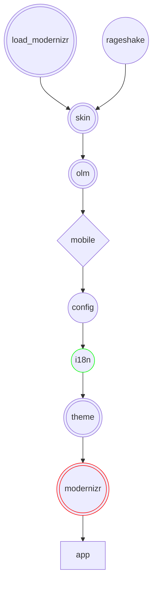
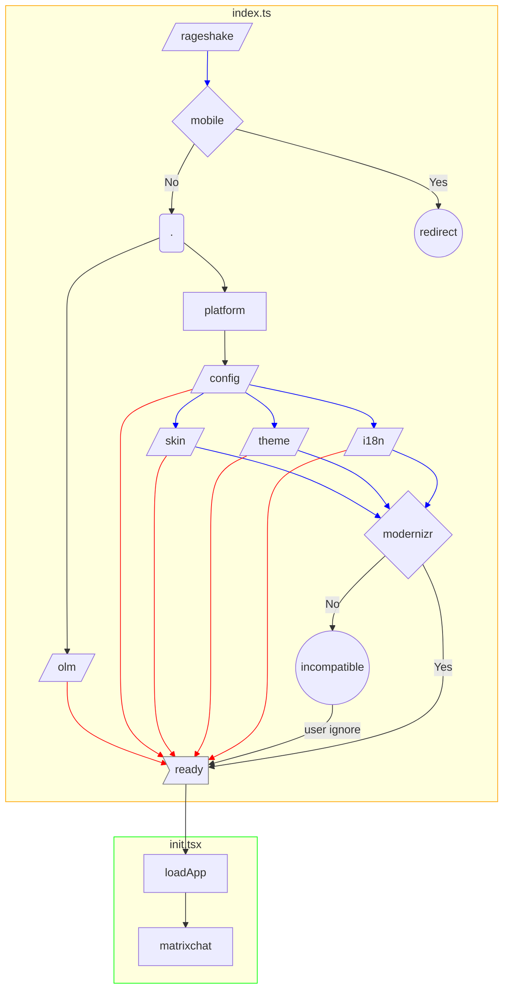
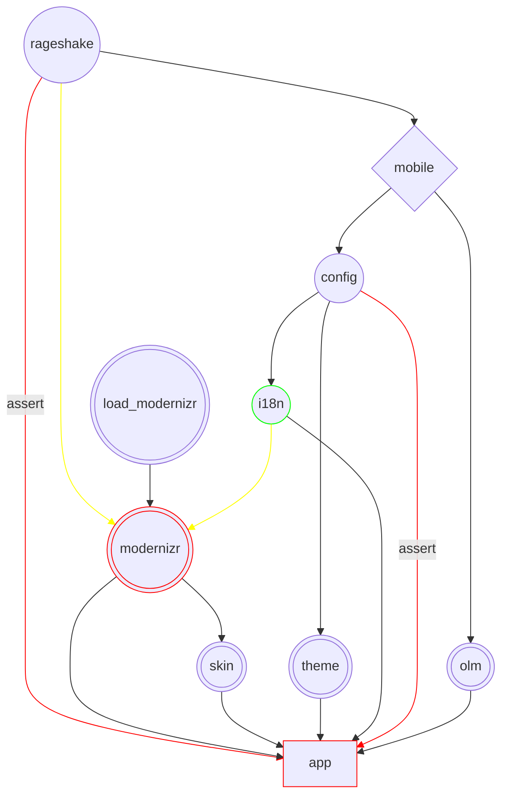

# App load order

**Dev note**: As of March 2022, the skin is no longer part of the app load order at all. The document's graphs have
been kept untouched for posterity.

Old slow flow:

Current more parallel flow:

Key:

- Parallelogram: async/await task
- Box: sync task
- Diamond: conditional branch
- Circle: user interaction
- Blue arrow: async task is allowed to settle but allowed to fail
- Red arrow: async task success is asserted

Notes:

- A task begins when all its dependencies (arrows going into it) are fulfilled.
- The success of setting up rageshake is never asserted, element-web has a fallback path for running without IDB (and thus rageshake).
- Everything is awaited to be settled before the Modernizr check, to allow it to make use of things like i18n if they are successful.

Underlying dependencies:

