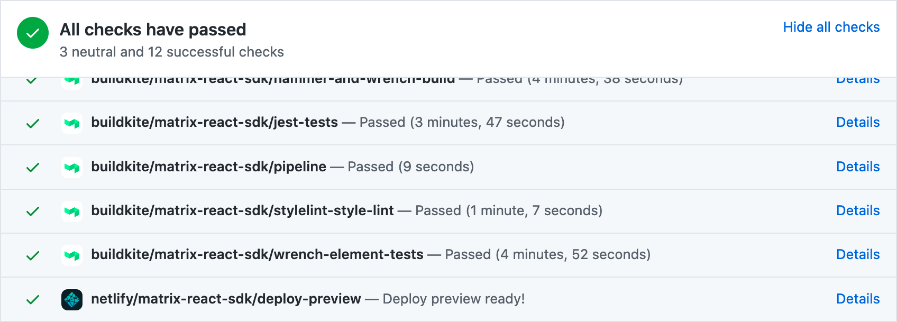

# Pull Request Previews

Pull requests to the React SDK layer (and in the future other layers as well)
automatically set up a preview site with a full deployment of Element with the
changes from the pull request added in so that anyone can easily test and review
them. This is especially useful for checking visual and interactive changes.

To access the preview site, scroll down to the bottom of the PR where the
various CI results are displayed:

The checks section could be collapsed at first, so you may need to click "Show
all checks" to reveal them. Look for an entry that mentions `deploy-preview`. It
may be at the end of the list, so you may need scroll a bit to see it. To access
the preview site, click the "Details" link in the deploy preview row.

**Important:** Please always use test accounts when logging into preview sites,
as they may contain unreviewed and potentially dangerous code that could damage
your account, exfiltrate encryption keys, etc.

## FAQs

### Are preview sites created for pull requests from contributors?

Yes, they are created for all PRs from any author.

### Do preview sites expire after some time period?

No, there is no expiry date, so they should remain accessible indefinitely, but
of course they obviously aren't meant to live beyond the development workflow,
so please don't rely on them for anything important. They may disappear at any
time without notice.
