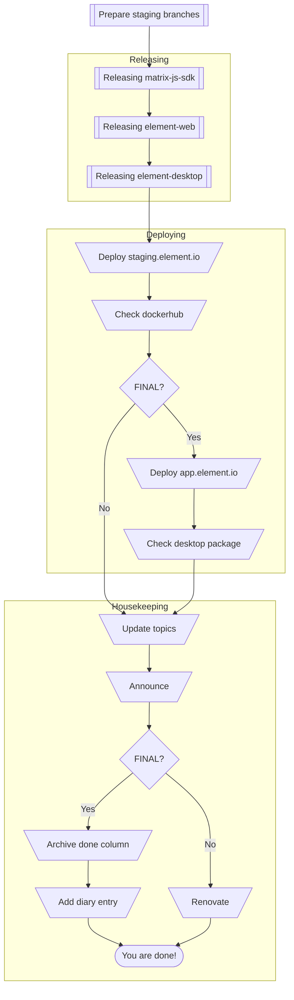

> Tip: Paste this into the browser console to make the checkboxes on this page tickable. (Bear in mind that your ticks will be lost if you reload though.)
>
> ```
> document.querySelectorAll("input[type='checkbox']").forEach(i => {i.disabled = false;})
> ```

<details><summary><h1>Branches</h1></summary><blockquote>

#### develop

The develop branch holds the very latest and greatest code we have to offer, as such it may be less stable.
It is auto-deployed on every commit to element-web or matrix-js-sdk to develop.element.io via GitHub Actions `build_develop.yml`.

#### staging

The staging branch corresponds to the very latest release regardless of whether it is an RC or not. Deployed to staging.element.io manually.
It is auto-deployed on every release of element-web to staging.element.io via GitHub Actions `deploy.yml`.

#### master

The master branch is the most stable as it is the very latest non-RC release. Deployed to app.element.io manually.

</blockquote></details>

<details><summary><h1>Versions</h1></summary><blockquote>

The matrix-js-sdk follows semver, most releases will bump the minor version number.
Breaking changes will bump the major version number.
Element Web & Element Desktop do not follow semver and always have matching version numbers. The patch version number is normally incremented for every release.

</blockquote></details>

<details><summary><h1>Release Types</h1></summary><blockquote>

#### Release candidate

A normal release begins with a Release Candidate on the Tick phase of the release cycle,
and may contain as many further RCs as are needed before the Tock phase of cycle.
Each subsequent RC may add additional commits via any of the means of preparation.

A normal release is the most typical run-of-the-mill release,
with at least one RC (Release Candidate) followed by a FINAL release.
The typical cadence for these is every 2 weeks we'll do a new initial RC,
then the following week we'll do that release cycle's FINAL release with sometimes more RCs in between, as needed.

#### Final

A normal release culminates with a Final release on the Tock phase of the cycle.
This may be merely shipping the very latest RC with an adjusted version number,
but can also include (hopefully small) additional changes present on `staging` if they are deemed safe to skip an RC.

### Hotfix / Security

This is an accelerated type of release which sits somewhere between RC and Final.
They tend to contain few patches delta from the previous release but also skip any form of RC
and in the case of Security the patch lands on GitHub only moments prior.
For all intents and purposes they are the same as a Final release but with a different purpose.

</blockquote></details>

<details><summary><h1>Release Blockers</h1></summary><blockquote>

You should become release rabbit on the day after the last full release.
For that week, it's your job to keep an eye on the Releases room and see whether any issues marked `X-Release-Blocker` are opened,
or were already open. You should chase people to fix them, so that on RC day you can make the release.

If release-blocking issues are still open, you need to delay the release until they are fixed or reclassified.

There are two labels for tracking release blockers.

#### X-Release-Blocker

This label applied to an issue means we cannot ship a release affected by the specific issue.
This means we cannot cut branches for an RC but security & hotfix releases may still be fine.

#### X-Upcoming-Release-Blocker

This label applied to an issue means that the next (read: not current) release cycle will be affected by the specific issue.
This label will automagically convert to `X-Release-Blocker` at the conclusion of a full release.

</blockquote></details>

<details><summary><h1>Repositories</h1></summary><blockquote>

This release process revolves around our main repositories:

- [Element Desktop](https://github.com/element-hq/element-desktop/)
- [Element Web](https://github.com/element-hq/element-web/)
- [Matrix JS SDK](https://github.com/matrix-org/matrix-js-sdk/)

We own other repositories, but they have more ad-hoc releases and are not part of the bi-weekly cycle:

- https://github.com/matrix-org/matrix-web-i18n/
- https://github.com/matrix-org/matrix-react-sdk-module-api

</blockquote></details>

<details><summary><h1>Prerequisites</h1></summary><blockquote>

- You must be part of the 2 Releasers GitHub groups:
    - <https://github.com/orgs/element-hq/teams/element-web-releasers>
    - <https://github.com/orgs/matrix-org/teams/element-web-releasers>
- You will need access to the **VPN** ([docs](https://gitlab.matrix.org/new-vector/internal/-/wikis/SRE/Tailscale)) to be able to follow the instructions under Deploy below.
- You will need the ability to **SSH** in to the production machines to be able to follow the instructions under Deploy below. Ensure that your SSH key has a non-empty passphrase, and you registered your SSH key with Ops. Log a ticket at https://github.com/matrix-org/matrix-ansible-private and ask for:
    - Two-factor authentication to be set up on your SSH key. (This is needed to get access to production).
    - SSH access to `horme` (staging.element.io and app.element.io)
    - Permission to sudo on horme as the user `element`
- You need "**jumphost**" configuration in your local `~/.ssh/config`. This should have been set up as part of your onboarding.

</blockquote></details>

<details><summary><h1>Overview</h1></summary><blockquote>



</blockquote></details>

---

# Preparation

The goal of this stage is to get the code you want to ship onto the `staging` branch.
There are multiple ways to accomplish this depending on the type of release you need to perform.

For the first RC in a given release cycle the easiest way to prepare branches is using the
[Cut branches automation](https://github.com/element-hq/element-web/actions/workflows/release_prepare.yml) -
this will take `develop` and merge it into the `staging` on the chosen repositories.

For subsequent RCs, if you need to include a change you may PR it directly to the `staging` branch or rely on the
backport automation via labelling a PR to `develop` with `backport staging` which will cause a new PR to be opened
which backports the requested change to the `staging` branch.

For security, you may wish to merge the security advisory private fork or apply the patches manually and then push them directly to `staging`.
It is worth noting that at the end of the Final/Hotfix/Security release `staging` is merged to `master` which is merged back into `develop` -
this means that any commit which goes to `staging` will eventually make its way back to the default branch.

- [ ] The staging branch is prepared

# Releasing

Shortly after concluding the preparation stage (or pushing any changes to `staging` in general);
a draft release will be automatically made on the 4 project repositories with suggested changelogs and version numbers.

_Note: we should add a step here to write summaries atop the changelogs manually, or via AI_

Publishing the SDKs to npm also commits a dependency upgrade to the relevant downstream projects,
if you skip a layer of this release (e.g. for a hotfix) then the dependency will remain on `#develop` which will be
switched back to the version of the dependency from the master branch to not leak develop code into a release.

### Matrix JS SDK

- [ ] Check the draft release which has been generated by [the automation](https://github.com/matrix-org/matrix-js-sdk/actions/workflows/release-drafter.yml)
- [ ] Make any changes to the release notes in the draft release as are necessary - **Do not click publish, only save draft**
- [ ] Kick off a release using [the automation](https://github.com/matrix-org/matrix-js-sdk/actions/workflows/release.yml) - making sure to select the right type of release. For anything other than an RC: choose final. You should not need to ever switch off either of the Publishing options.

### Element Web

- [ ] Check the draft release which has been generated by [the automation](https://github.com/element-hq/element-web/actions/workflows/release-drafter.yml)
- [ ] Make any changes to the release notes in the draft release as are necessary - **Do not click publish, only save draft**
- [ ] Kick off a release using [the automation](https://github.com/element-hq/element-web/actions/workflows/release.yml) - making sure to select the right type of release. For anything other than an RC: choose final. You should not need to ever switch off either of the Publishing options.

### Element Desktop

- [ ] Check the draft release which has been generated by [the automation](https://github.com/element-hq/element-desktop/actions/workflows/release-drafter.yml)
- [ ] Make any changes to the release notes in the draft release as are necessary - **Do not click publish, only save draft**
- [ ] Kick off a release using [the automation](https://github.com/element-hq/element-desktop/actions/workflows/release.yml) - making sure to select the right type of release. For anything other than an RC: choose final. You should not need to ever switch off either of the Publishing options.

# Deploying

We ship the SDKs to npm, this happens as part of the release process.
We ship Element Web to dockerhub, `*.element.io`, and packages.element.io.
We ship Element Desktop to packages.element.io.

- [ ] Check that element-web has shipped to dockerhub
- [ ] Check that the staging [deployment](https://github.com/element-hq/element-web/actions/workflows/deploy.yml) has completed successfully
- [ ] Test staging.element.io

For final releases additionally do these steps:

- [ ] Deploy app.element.io. [See docs.](https://handbook.element.io/books/element-web-team/page/deploying-appstagingelementio)
- [ ] Test app.element.io
- [ ] Ensure Element Web package has shipped to packages.element.io
- [ ] Ensure Element Desktop packages have shipped to packages.element.io

If you need to roll back a deployment to staging.element.io,
you can run the `deploy.yml` automation choosing an older tag which you wish to deploy.

# Housekeeping

We have some manual housekeeping to do in order to prepare for the next release.

- [ ] Update topics using [the automation](https://github.com/element-hq/element-web/actions/workflows/update-topics.yaml). It will autodetect the current latest version. Don't forget the date you supply should be e.g. September 5th (including the "th") for the script to work.
- [ ] Announce the release in [#element-web-announcements:matrix.org](https://matrix.to/#/#element-web-announcements:matrix.org)

<details><summary>(show)</summary>

With wording like:

> Element Web v1.11.24 is here!
>
> This version adds ... and fixes bugs ...
>
> Check it out at app.element.io, in Element Desktop, or from Docker Hub. Changelog and more details at https://github.com/element-hq/element-web/releases/tag/v1.11.24

</details>

For the first RC of a given release cycle do these steps:

- [ ] Go to the [matrix-js-sdk Renovate dashboard](https://github.com/matrix-org/matrix-js-sdk/issues/2406) and click the checkbox to create/update its PRs.

- [ ] Go to the [element-web Renovate dashboard](https://github.com/element-hq/element-web/issues/22941) and click the checkbox to create/update its PRs.

- [ ] Go to the [element-desktop Renovate dashboard](https://github.com/element-hq/element-desktop/issues/465) and click the checkbox to create/update its PRs.

- [ ] Later, check back and merge the PRs that succeeded to build. The ones that failed will get picked up by the [maintainer](https://docs.google.com/document/d/1V5VINWXATMpz9UBw4IKmVVB8aw3CxM0Jt7igtHnDfSk/edit#).

For final releases additionally do these steps:

- [ ] Archive done column on the [team board](https://github.com/orgs/element-hq/projects/67/views/34) _Note: this should be automated_
- [ ] Add entry to the [milestones diary](https://docs.google.com/document/d/1cpRFJdfNCo2Ps6jqzQmatzbYEToSrQpyBug0aP_iwZE/edit#heading=h.6y55fw4t283z). The document says only to add significant releases, but we add all of them just in case.
