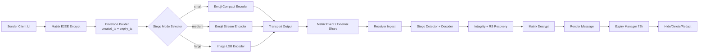

# Matrix Steganography Messaging: Architecture & Workflow Blueprint

Date: 2026-02-10  
Repository: `blackout` (Element Web fork)

## 1) Goal

Design a production-oriented messaging architecture that combines:

- Matrix as the secure transport and synchronization backbone
- End-to-end encryption (Matrix Olm/Megolm)
- Steganographic payload containers (emoji and optional image fallback)
- Ephemeral message lifecycle (72-hour expiry)

The intent is to preserve strong confidentiality while making ciphertext appear as innocuous content when shared across channels.

---

## 2) System Components

### A. Matrix Backbone

**Responsibilities**

- Identity, device trust, session establishment
- E2EE key exchange and message encryption/decryption
- Multi-device sync, retries, federation support

**Interfaces**

- Matrix room/direct-message events (`m.room.message`)
- Device key APIs and cross-signing
- Event metadata for expiry (`expiry_ts` or equivalent client-managed metadata)

### B. Steganography Engine

**Responsibilities**

- Convert encrypted payload bytes into a transport container
- Decode container back into original encrypted payload
- Add integrity + error-correction framing

**Container modes**

1. **Emoji-compact mode** (short payloads)  
   - Encodes encrypted bytes + metadata into a short emoji sequence.
2. **Emoji-stream mode** (medium payloads)  
   - Encodes larger payloads into longer emoji strings.
3. **Image-LSB mode** (large payloads fallback)  
   - Embeds payload bits into PNG/lossless carrier.

### C. Ephemeral Lifecycle Manager

**Responsibilities**

- Attach expiry metadata at send time (`now + 72h`)
- Start local expiry timers when event is received/decrypted
- Remove content from local storage/UI at expiry
- Optionally issue redaction event (for Matrix room cleanup)

### D. Cross-channel Share Adapter

**Responsibilities**

- Export stego payload to OS share sheet or copy/paste
- Import inbound content for scan/decode/decrypt
- Maintain UX parity across Matrix-native and external channels

---

## 3) Data Envelope Specification (recommended)

Use a compact binary envelope before stego encoding:

- `version` (1 byte)
- `mode` (1 byte: emoji compact/emoji stream/image)
- `created_ts` (8 bytes)
- `expiry_ts` (8 bytes)
- `ciphertext_len` (varint)
- `ciphertext` (N bytes)
- `nonce/iv` (if required by chosen crypto primitive)
- `auth_tag` (if AEAD output not in ciphertext blob)
- `crc32` (optional quick corruption detection)
- `rs_parity` (optional Reed-Solomon parity bytes)

This envelope is the payload for stego codecs.

---

## 4) End-to-End Workflow

### Sending Path

1. User composes plaintext message.
2. Matrix E2EE encrypts message payload for recipient/device set.
3. Envelope is built with `created_ts` and `expiry_ts = now + 72h`.
4. Stego mode selection based on payload size:
   - Small => emoji-compact
   - Medium => emoji-stream
   - Large => image-LSB
5. Encoded container is emitted:
   - Matrix message event and/or
   - external share target (copy/share sheet)
6. UI stores local expiry state and displays countdown metadata.

### Receiving Path

1. Incoming text/image is scanned for supported stego signatures.
2. Stego decoder reconstructs the binary envelope.
3. Envelope integrity checks run (version/checksum/parity recovery).
4. Ciphertext is decrypted via Matrix keys.
5. Message is rendered in timeline.
6. Expiry manager schedules deletion/redaction at `expiry_ts`.

---

## 5) Emoji Encoding Strategy

### Practical mapping

- Use a curated emoji alphabet (stable rendering across platforms).
- Convert payload bytes to radix-N digits (`N = emoji alphabet size`).
- Prefix with small header segment (version + mode + length bucket).
- Apply optional parity blocks every K symbols.

### Why this approach

- Deterministic, reversible encoding
- Avoids fragile Unicode tricks as the *primary* channel
- Easier to test than dense zero-width-only encoding

### Optional stealth extensions (advanced)

- Zero-width variation markers for additional bit density
- Mixed “natural language + emoji” camouflage templates

---

## 6) Image Fallback Strategy

- Restrict to PNG/lossless carriers to survive recompression risk.
- LSB embedding in selected channels/pixels with keyed pseudo-random placement.
- Add parity/error correction for mild transformations.
- Reject decode when integrity checks fail.

---

## 7) Ephemeral Policy (72 hours)

### Required behavior

- Every encoded message must carry `expiry_ts`.
- Client must suppress display after expiry even if event persists remotely.
- Local plaintext caches must be deleted at expiry.

### Recommended behavior

- On expiry, issue Matrix redaction where permissions allow.
- If redaction fails, keep local tombstone state and hide payload permanently.
- For “delete-on-read” mode, set `expiry_ts = read_ts + delta` or immediate redaction policy.

---

## 8) Threat Model & Security Notes

### Defended

- Passive observers of transport content (see innocuous emoji/image content)
- Server-side plaintext exposure (message remains encrypted)
- Opportunistic content scanning without decoder keys/logic

### Not fully defended

- Endpoint compromise (malware/screen capture/key theft)
- Traffic analysis / metadata leakage (sender, recipient, timing)
- Lossy channel mutation that destroys stego payload beyond parity recovery

### Controls

- Keep Matrix E2EE as primary security boundary.
- Treat steganography as concealment, not replacement for cryptography.
- Use robust integrity checks and fail-closed decode behavior.

---

## 9) Implementation Plan (phased)

### Phase 1: MVP

- Emoji-stream codec with deterministic radix mapping
- Envelope format + checksum
- 72-hour local expiry enforcement
- Matrix room send/receive integration

### Phase 2: Reliability

- Reed-Solomon parity blocks
- Cross-platform rendering test matrix for emoji alphabet
- Better corruption diagnostics + user feedback

### Phase 3: Advanced

- Image-LSB fallback
- Share-sheet import/export pipelines
- Optional delete-on-read semantics

### Phase 4: Hardening

- Fuzz tests for decode/parser
- Adversarial mutation corpus tests
- Telemetry on decode failures (privacy-preserving aggregate only)

---

## 10) Suggested Runtime Architecture Diagram

---

## 11) Acceptance Criteria

- Message can be encrypted, encoded to emoji, transmitted, decoded, and decrypted correctly.
- Payload survives expected copy/paste paths for supported channels.
- Expiry reliably hides/deletes content at 72 hours across app restarts.
- Decoder rejects malformed payloads without crashes or partial plaintext leaks.
- Multi-device Matrix sessions can decrypt synchronized events correctly.

---

## 12) Next Build Targets

1. Implement `EnvelopeV1` serializer/deserializer with strict validation.
2. Implement `EmojiRadixCodec` with fixed emoji alphabet and test vectors.
3. Wire codec into send/receive pipeline behind a feature flag.
4. Add `EphemeralManager` with persistent timer rehydration.
5. Add integration tests for end-to-end encode/decode/expiry behavior.
